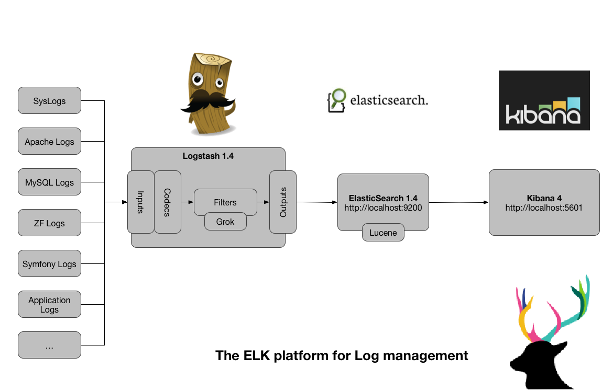

# elk

&emsp;&emsp;logstash,elasticsearch,kibana 怎么进行nginx的日志分析呢？首先，架构方面，nginx是有日志文件的，它的每个请求的状态等都有日志文件进行记录。其次，需要有个队列，redis的list结构正好可以作为队列使用。然后分析使用elasticsearch就可以进行分析和查询了。      
&emsp;&emsp;我们需要的是一个分布式的，日志收集和分析系统。logstash有agent和indexer两个角色。对于agent角色，放在单独的web机器上面，然后这个agent不断地读取nginx的日志文件，每当它读到新的日志信息以后，就将日志传送到网络上的一台redis队列上。对于队列上的这些未处理的日志，有不同的几台logstash indexer进行接收和分析。分析之后存储到elasticsearch进行搜索分析。再由统一的kibana进行日志web界面的展示。   
&emsp;&emsp;下面我计划在一台机器上实现这些角色。
 
### 准备工作
* 安装了redis,开启在6379端口   
* 安装了elasticsearch, 开启在9200端口   
* 安装了kibana, 开启了监控web
* logstash安装在/usr/local/logstash
* nginx开启了日志，目录为：/usr/share/nginx/logs/test.access.log

### 设置nginx日志格式
&emsp;&emsp;在nginx.conf 中设置日志格式：logstash
 ```
 log_format logstash '$http_host $server_addr $remote_addr [$time_local] "$request" '
                     '$request_body $status $body_bytes_sent "$http_referer" "$http_user_agent" '
                     '$request_time $upstream_response_time';
```
&emsp;&emsp;在vhost/test.conf中设置access日志：
```
access_log  /usr/share/nginx/logs/test.access.log  logstash;
```

### 开启logstash agent

&emsp;&emsp;注：这里也可以不用logstash，直接使用rsyslog   
&emsp;&emsp;创建logstash agent 配置文件
```
 vim /usr/local/logstash/etc/logstash_agent.conf
```
 &emsp;&emsp;代码如下：
 ```
 input {
         file {
                 type => "nginx_access"
                 path => ["/usr/share/nginx/logs/test.access.log"]
         }
 }
 output {
         redis {
                 host => "localhost"
                 data_type => "list"
                 key => "logstash:redis"
         }
 }
 ```
&emsp;&emsp;启动logstash agent
 ```
 /usr/local/logstash/bin/logstash -f /usr/local/logstash/etc/logstash_agent.conf
```
 &emsp;&emsp;这个时候，它就会把test.access.log中的数据传送到redis中，相当于tail -f。

### 开启logstash indexer
&emsp;&emsp; 创建 logstash indexer 配置文件
```
 vim /usr/local/logstash/etc/logstash_indexer.conf
```
&emsp;&emsp; 代码如下：
 ```
 input {
         redis {
                 host => "localhost"
                 data_type => "list"
                 key => "logstash:redis"
                 type => "redis-input"
         }
 }
 filter {
     grok {
         match => [
             "message", "%{WORD:http_host} %{URIHOST:api_domain} %{IP:inner_ip} %{IP:lvs_ip} \[%{HTTPDATE:timestamp}\] \"%{WORD:http_verb} %{URIPATH:baseurl}(?:\?%{NOTSPACE:request}|) HTTP/%{NUMBER:http_version}\" (?:-|%{NOTSPACE:request}) %{NUMBER:http_status_code} (?:%{NUMBER:bytes_read}|-) %{QS:referrer} %{QS:agent} %{NUMBER:time_duration:float} (?:%{NUMBER:time_backend_response:float}|-)"
         ]
     }
     kv {
         prefix => "request."
         field_split => "&"
         source => "request"
     }
     urldecode {
         all_fields => true
     }
     date {
         type => "log-date"
         match => ["timestamp" , "dd/MMM/YYYY:HH:mm:ss Z"]
     }
 }
 output {
         elasticsearch {
                 embedded => false
                 protocol => "http"
                 host => "localhost"
                 port => "9200"
                 index => "access-%{+YYYY.MM.dd}"
         }
 }
 ```
 &emsp;&emsp;这份配置是将nginx_access结构化以后塞入elasticsearch中。  
 &emsp;&emsp;对这个配置进行下说明：
* grok中的match正好匹配和不论是GET，还是POST的请求。   
* kv是将request中的A=B&C=D的key，value扩展开来，并且利用es的无schema的特性，保证了如果你增加了一个参数，可以立即生效   
* urldecode是为了保证参数中有中文的话进行urldecode   
* date是为了让es中保存的文档的时间为日志的时间，否则是插入es的时间   

&emsp;&emsp;好了，现在的结构就完成了，你可以访问一次test.dev之后就在kibana的控制台看到这个访问的日志了。而且还是结构化好的了，非常方便查找。  
 ### 使用kibana进行查看
 &emsp;&emsp;依次开启es，logstash，kibana之后，可以使用es的head插件确认下es中有access-xx.xx.xx索引的数据，然后打开kibana的页面，第一次进入的时候会让你选择mapping，索引名字填写access-\*，则kibana自动会创建mapping  


### 1. install java8
 ```
 sudo add-apt-repository ppa:webupd8team/java
 sudo apt-get install oracle-java8-installer
 ```

### 2. install es 2.3.3
```
 wget https://download.elastic.co/elasticsearch/elasticsearch/elasticsearch-2.3.3.deb
 sudo dpkg -i elasticsearch-2.3.3.deb
 sudo update-rc.d elasticsearch defaults
 sudo chmod 755 /etc/elasticsearch/
 sudo mv elasticsearch.yml /etc/elasticsearch/
 sudo service elasticsearch start
 ```

### 3. install kibana
```
 wget https://download.elastic.co/kibana/kibana/kibana_4.5.1_amd64.deb
 sudo dpkg -i kibana_4.5.1_amd64.deb
 sudo update-rc.d kibana defaults
 sudo service kibana start

 sudo htpasswd -c /etc/nginx/htpasswd username
 password
 ```
### 4. install logstash
```
 wget https://download.elastic.co/logstash/logstash/packages/debian/logstash_2.3.3-1_all.deb
 sudo dpkg -i logstash_2.3.3-1_all.deb
 sudo update-rc.d logstash defaults
 sudo service logstash start
 ```
### 5. install marvel
```
 sudo /usr/share/elasticsearch/bin/plugin install license
 sudo /usr/share/elasticsearch/bin/plugin install marvel-agent
 sudo /opt/kibana/bin/kibana plugin --install elasticsearch/marvel/2.3.3

 REFER: https://www.elastic.co/guide/en/marvel/current/installing-marvel.html
 ```

### 6. install head
 ```
 sudo /usr/share/elasticsearch/bin/plugin install mobz/elasticsearch-head

 REFER: https://mobz.github.io/elasticsearch-head/
```
